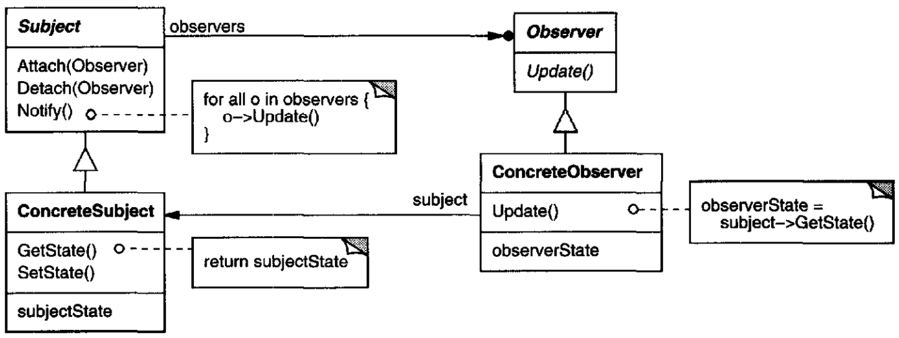

# 2-concurrent-observers

This repository is intended to showcase the basic usage, advantages and challenges
of `concurrent` programming with `Java`
on the example of the `Observer` `Design Pattern`. 

*[UML diagram of the Observer pattern - taken from the famous `Design Patterns - Elements of Reusable Object-Oriented Software` book by GoF]*

## Structure
In the subpackages of the `main.observer` package you can find three different implementation approaches:
1. `sequential` - Notifications and updates happen sequentially.
The time to process all updates of one notification is the sum of the time of each update for each individual observer.

2. `busywaiting` - Each observer has its own thread, that is always checking for updates.
This solution consumes a lot of resources.

3. `lazywaiting` - Each observer has its own thread, but the thread is not constantly 'awake'.
It gets woken up by the notification of a subject/observee.
Lost updates are unlikely, but still possible.

---
Two other approaches are to be implemented:

1. `tooconcurrent` - Each update happens in its own thread.
   The time to process all updates of one notification is equal to the time, that the slowest Observer needs to update
   (as it is for all concurrent solutions).
   Lost updates are probable.

2. `mutualexclusion` - Using the `synchronized` keyword we define a so called `Mutex` or `Critical Section`,
   so that only one thread can enter that critical section at any time.
   This solves our remaining problem of lost updates from `lazywaiting`.
