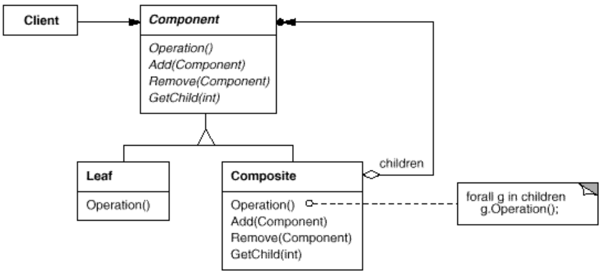

# 5-composite-file-system

This repository is intended to demonstrate how a typical composite pattern can be implemented in `Java`
based on the example of a simple file system structure.

*[UML diagram of the Composite pattern - taken from the famous `Design Patterns - Elements of Reusable Object-Oriented Software` book by GoF]*

`Directories` are `Composites` containing `FileSystemElements` (`Components`).
A `FileSystemElement` is either a `Directory` or a `File` (atomic `Component` or `Leaf`).

Every `File` has a size.
The size of a directory is the sum of the sizes of its contained subdirectories and files.
One can fetch the size of a `FileSystemElement` by calling its `fetchSize()` method.
